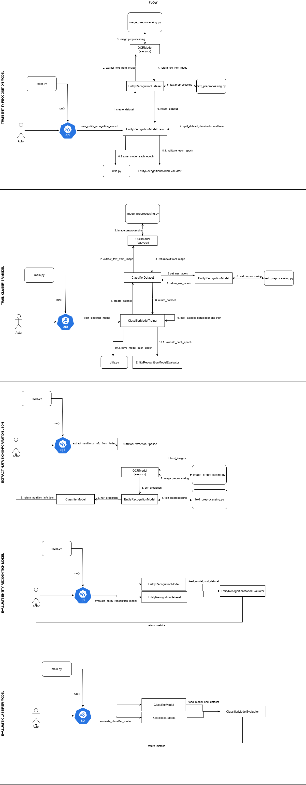

# NIQ

# NIQ - Nutritional Information Extraction from Product Images

This repository is structured to solve a two-part task aimed at the exploration and modeling of data derived from **Open Food Facts**, a large-scale public database with multimodal product information.


## Folder Structure

```plaintext

NIQ
├── api/
│   ├── __init__.py
│   └── api.py
├── data/
├── data_preprocessing/
│   ├── __init__.py
│   ├── image_preprocessing.py
│   └── text_preprocessing.py
├── logs/
│   └── api.log
├── model/
│   ├── __init__.py
│   ├── classifier_model.py
│   ├── entity_recognition_model.py
│   ├── evaluation.py
│   ├── nutrition_extraction_pipeline.py
│   ├── ocr_model.py
│   └── train.py
├── models/
│   └── prueba.pth
├── notebooks/
│   └── EDA.ipynb
├── utils/
│   ├── __init__.py
│   ├── config.py
│   ├── create_dataset.py
│   ├── logger.py
│   ├── utils.py
│   └── visualization.py
├── main.py
├── NIQ.drawio
├── NIQ.drawio.png
├── README.md
└── requirements.txt
```

## Folder Structure Overview
### 1. `api/`
This directory contains the core logic for the API. It includes:

- `__init__.py`: Initializes the API as a Python package.
- `api.py`: Contains the routes and API functions to train the model, and return predictions and models evaluations.

### 2. `data/`
This folder is used for storing raw datasets, including images, text, and so on.

### 3. `data_preprocessing/`
This folder handles data cleaning and preparation:

- `image_preprocessing.py`: Functions for preprocessing images (e.g. transformation to gray scale, rotation).
- `text_preprocessing.py`: Functions for preparing text data (e.g. text cleaning, tokenization).

### 4. `logs/`
Contains the log files generated by the application. For instance:

- `api.log`: Logs API interactions, errors, and debugging information.

### 5. `model/`
This directory holds the models and scripts for training, evaluation, and prediction:

- `classifier_model.py`: Defines the classification model used to classify if a group of tokens are related (e.g. ["Proteins", "10.5", "g"]).
- `entity_recognition_model.py`: Contains the entity recognition model for identifying quantities, units and nutrition-related entities from the ocr model's output.
- `evaluation.py`: Includes evaluation functions to measure the entity recognition model and the classifier model performance.
- `nutrition_extraction_pipeline.py`: The pipeline for extracting nutritional information (image -> ocr_model -> entity_recognition_model -> classifier_model -> nutrition_information_json).
- `ocr_model.py`: Model responsible for extracting text from images using OCR (easyocr model).
- `train.py`: Script for training entity recognition models and classifier models.

### 6. `models/`
This directory stores the trained model(s). For example:

- `prueba.pth`: A PyTorch model file containing the trained parameters.

### 7. `notebooks/`
This directory includes Jupyter Notebooks used for exploratory data analysis (EDA):

- `EDA.ipynb`: An exploratory data analysis notebook for understanding the open food facts dataset and its features.

### 8. `utils/`
Contains utility functions and helper scripts:

- `config.py`: Stores configuration settings for the project.
- `create_dataset.py`: Script for preparing and splitting datasets for both the entity recognition model and the classifier model.
- `logger.py`: A custom logging utility.
- `utils.py`: General utility functions.
- `visualization.py`: Functions for model performance visualization.

### 9. `main.py`
Main entry point for starting the API server.

### 10. `NIQ.drawio` & `NIQ.drawio.png`
These files contain a visual representation of the project's flow, helping to understand the system better.

### 11. `README.md`
This file contains the project's documentation, including an overview of the project.

### 12. `requirements.txt`
Lists the Python dependencies required for the project. You can install them using:

```bash
pip install -r requirements.txt
```

## System Pipeline


